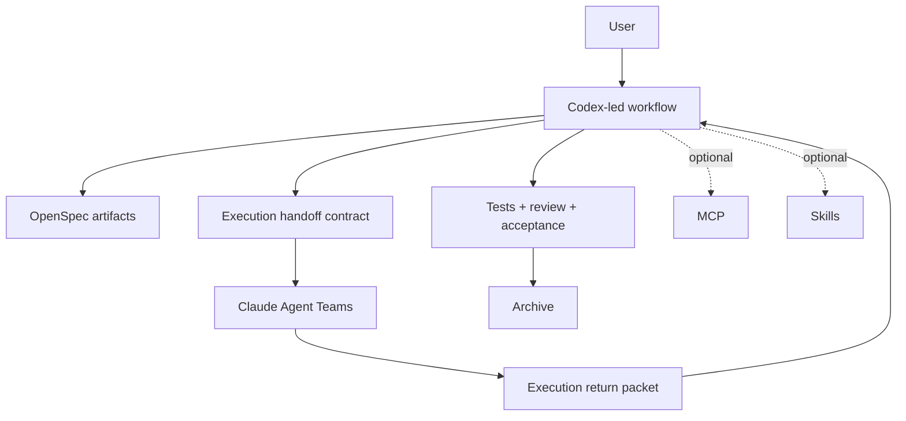

# CCGS

<div align="center">

[](https://www.npmjs.com/package/ccgs-workflow)
[](https://opensource.org/licenses/MIT)
[]()

[English](./README.md) | [简体中文](./README.zh-CN.md)

</div>

CCGS is the native Codex-led workflow package. The extra `S` stands for `Spec`: OpenSpec is the backbone, Codex owns workflow progression, Claude Agent Teams handle bounded execution, and Codex performs review, testing, acceptance, and archive decisions.

This repository no longer uses the upstream README as its product story. Upstream compatibility remains valuable, but the maintained default path in this fork is:

1. Codex creates or advances the OpenSpec change.
2. Codex prepares the execution handoff contract.
3. Claude Agent Teams implement the scoped work.
4. Codex reviews the return packet, verifies results, and decides archive readiness.

## Why This Fork

- Codex is the workflow owner, not a side model behind another orchestrator.
- OpenSpec is required for the maintained path, not an optional afterthought.
- Claude remains important, but primarily as the execution layer.
- MCP and reusable skills are optional integrations rather than baseline requirements.
- Legacy surfaces are not part of the maintained product path.

## Primary Workflow

The recommended end-to-end flow is:

```bash
/ccgs:spec-init
/ccgs:spec-research <request>
/ccgs:spec-plan
/ccgs:team-plan
/ccgs:team-exec
/ccgs:team-review
/ccgs:spec-review
openspec archive <change-id>
```

`/ccgs:spec-impl` is the managed shortcut when you want Codex to dispatch Claude execution and keep acceptance inside the same Codex-led loop.

## Codex-Native Entrypoint

After install, CCGS also places Codex-native skills under `~/.codex/skills/`:

- `ccgs-spec-init`
- `ccgs-spec-plan`
- `ccgs-spec-impl`

That means the maintained path can start directly inside Codex instead of relying on Claude as the shell host.

## Installation

### Prerequisites

- Node.js 20+
- Codex CLI for the primary host workflow
- Claude Code CLI for Agent Teams execution and compatibility command surfaces

Optional:

- MCP tooling
- Extra reusable skills

### Install

```bash
npx ccgs-workflow
``` 

You can also run:

```bash
npx ccgs-workflow init
npx ccgs-workflow monitor
npx ccgs-workflow menu
npx ccgs-workflow update
```

During setup, the installer asks who orchestrates the workspace before frontend/backend model selection. Codex is the recommended default, but Claude can still be selected for compatibility.

## What Gets Installed

Current install behavior keeps compatibility with existing environments:

- Claude-facing commands and assets are installed under `~/.claude/`
- Codex-native workflow skills are installed under `~/.codex/skills/`
- Workflow configuration is stored under `~/.claude/.ccgs/`
- The Claude hook monitor is installed under `~/.claude/.ccgs/claude-monitor`
- Claude hook entries are written into `~/.claude/settings.json`

## Compatibility Policy

`ccgs` is the canonical maintained namespace. The remaining `ccg` surfaces exist only as migration bridges:

- package and binary aliases such as `ccg-workflow` and `ccg`
- pre-existing runtime directories such as `~/.claude/.ccg/`
- pre-existing installed assets under `commands/ccg`, `agents/ccg`, `skills/ccg`, and older Codex workflow skill names

New installs write canonical assets under `ccgs` and `.ccgs`. Existing `ccg` assets are detected, migrated, or read as compatibility inputs when needed, but they are no longer the maintained default path.

## Repository Landmarks

```text
src/
├── cli.ts
├── cli-setup.ts
├── commands/
├── utils/
└── i18n/

templates/
├── commands/
├── prompts/
└── skills/

openspec/
└── changes/

claude-monitor/
├── server/
├── client/
└── scripts/
```

## Architecture



## Contributing

- Prefer OpenSpec-first changes over direct ad hoc edits.
- Keep compatibility flows labeled as compatibility before removing them.
- Do not assume MCP or extra skills are mandatory in new product language.
- Keep the maintained path centered on Codex orchestration, Claude Agent Teams execution, and Codex review.

Project workflow and project guidance are documented in [AGENTS.md](./AGENTS.md).

## License

MIT
