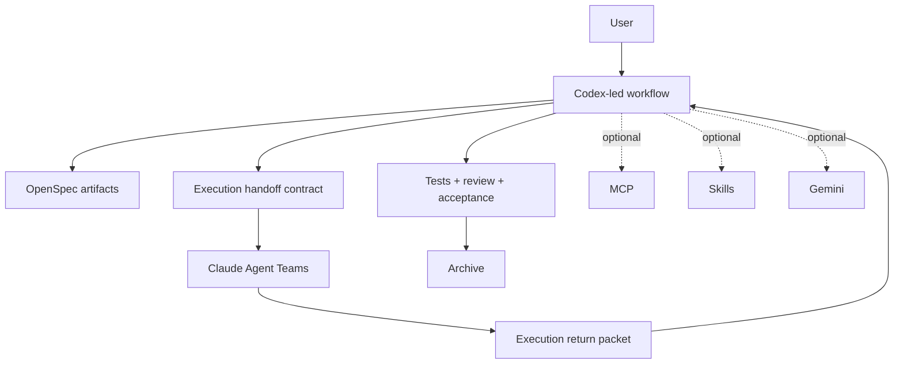

# CCGS

<div align="center">

[](https://www.npmjs.com/package/ccg-workflow)
[](https://opensource.org/licenses/MIT)
[]()

[English](./README.md) | [简体中文](./README.zh-CN.md)

</div>

CCGS is the Codex-led fork of `ccg-workflow`. In this fork, the extra `S` stands for `Spec`: OpenSpec is the backbone, Codex owns workflow progression, Claude Agent Teams handle bounded execution, and Codex performs review, testing, acceptance, and archive decisions.

This repository no longer uses the upstream README as its product story. Upstream compatibility remains valuable, but the maintained default path in this fork is:

1. Codex creates or advances the OpenSpec change.
2. Codex prepares the execution handoff contract.
3. Claude Agent Teams implement the scoped work.
4. Codex reviews the return packet, verifies results, and decides archive readiness.

## Why This Fork

- Codex is the workflow owner, not a side model behind another orchestrator.
- OpenSpec is required for the maintained path, not an optional afterthought.
- Claude remains important, but primarily as the execution layer.
- MCP, reusable skills, and Gemini are optional integrations rather than baseline requirements.
- Legacy and upstream-compatible command surfaces stay available while the Codex-led path matures.

## Primary Workflow

The recommended end-to-end flow is:

```bash
/ccg:spec-init
/ccg:spec-research <request>
/ccg:spec-plan
/ccg:team-plan
/ccg:team-exec
/ccg:team-review
/ccg:spec-review
openspec archive <change-id>
```

`/ccg:spec-impl` is the managed shortcut when you want Codex to dispatch Claude execution and keep acceptance inside the same Codex-led loop.

## Codex-Native Entrypoint

After install, CCGS also places Codex-native skills under `~/.codex/skills/`:

- `ccg-spec-init`
- `ccg-spec-plan`
- `ccg-spec-impl`

That means the maintained path can start directly inside Codex instead of relying on Claude as the shell host.

## Compatibility Flows

These flows still exist, but they are compatibility or secondary paths rather than the main product story:

- `/ccg:workflow`
- `/ccg:plan`
- `/ccg:execute`
- `/ccg:team-research`
- `/ccg:frontend`
- `/ccg:codex-exec`

Utility commands such as `/ccg:backend`, `/ccg:debug`, `/ccg:review`, `/ccg:test`, `/ccg:commit`, and `/ccg:worktree` remain available as well.

## Installation

### Prerequisites

- Node.js 20+
- Codex CLI for the primary host workflow
- Claude Code CLI for Agent Teams execution and compatibility command surfaces

Optional:

- Gemini CLI
- MCP tooling
- Extra reusable skills

### Install

```bash
npx ccg-workflow
```

You can also run:

```bash
npx ccg-workflow init
npx ccg-workflow menu
npx ccg-workflow update
```

During setup, the installer asks who orchestrates the workspace before frontend/backend model selection. Codex is the recommended default, but Claude can still be selected for compatibility.

## What Gets Installed

Current install behavior keeps compatibility with existing environments:

- Claude-facing commands and assets are installed under `~/.claude/`
- Codex-native workflow skills are installed under `~/.codex/skills/`
- Workflow configuration is stored under `~/.claude/.ccg/`
- `codeagent-wrapper` remains the backend invocation boundary

## Repository Landmarks

```text
src/
├── cli.ts
├── cli-setup.ts
├── commands/
├── utils/
└── i18n/

templates/
├── commands/
├── prompts/
└── skills/

openspec/
└── changes/

codeagent-wrapper/
└── main.go
```

## Architecture



## Contributing

- Prefer OpenSpec-first changes over direct ad hoc edits.
- Keep compatibility flows labeled as compatibility before removing them.
- Do not assume MCP, skills, or Gemini are mandatory in new product language.
- If you change Go code under `codeagent-wrapper/`, keep the wrapper version in sync with `src/utils/installer.ts`.

Project workflow and project guidance are documented in [AGENTS.md](./AGENTS.md).

## License

MIT
