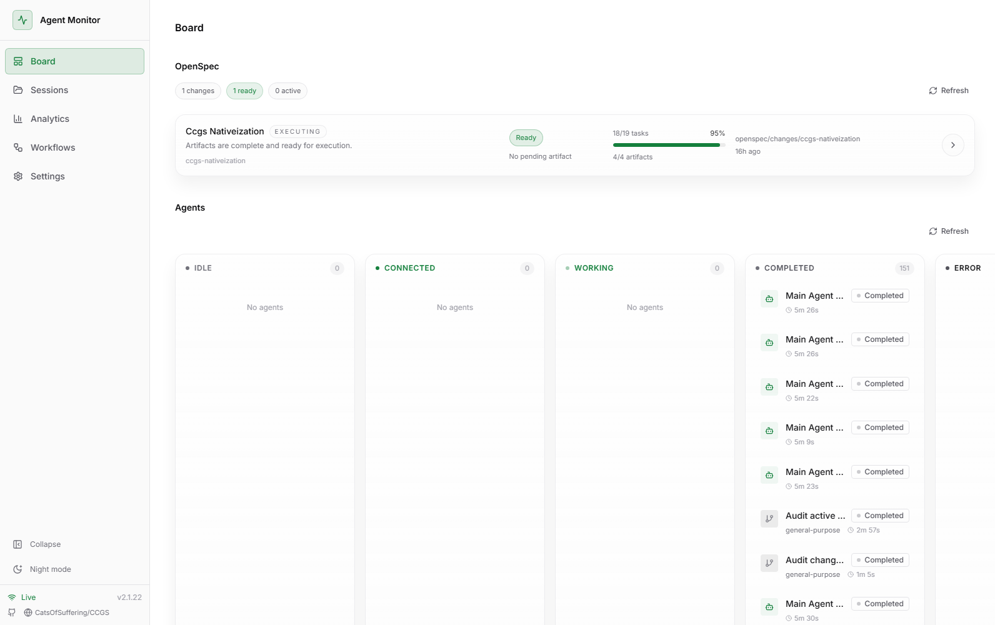
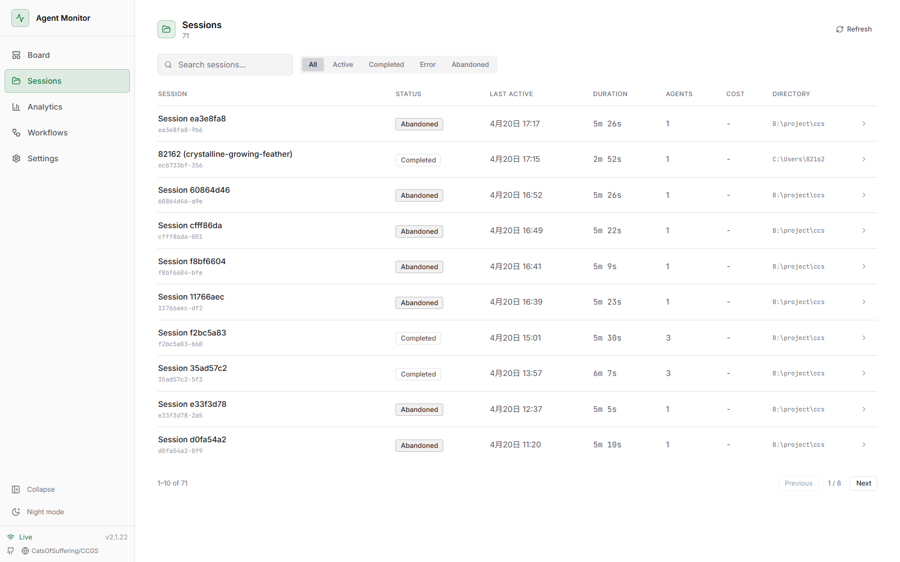
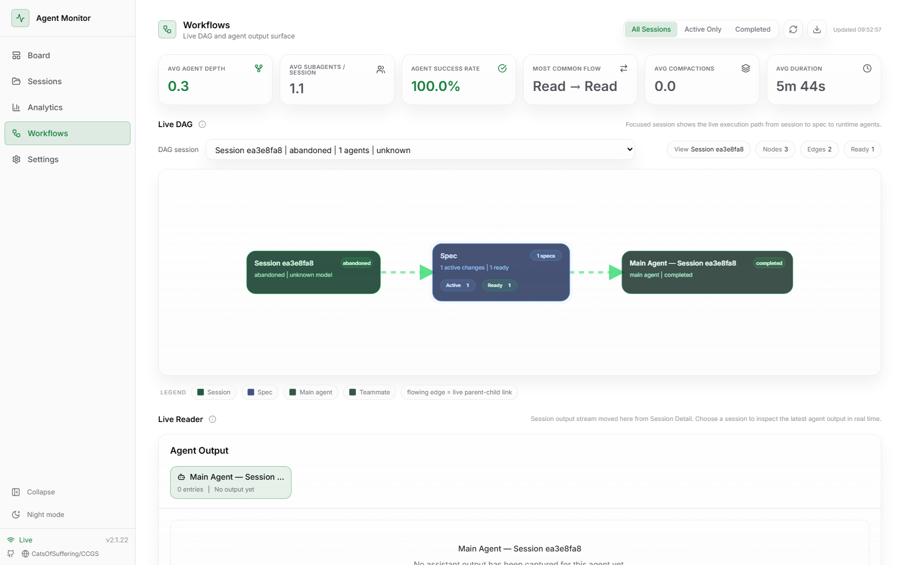
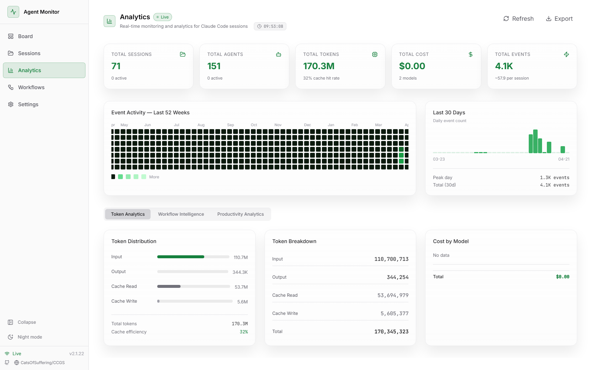
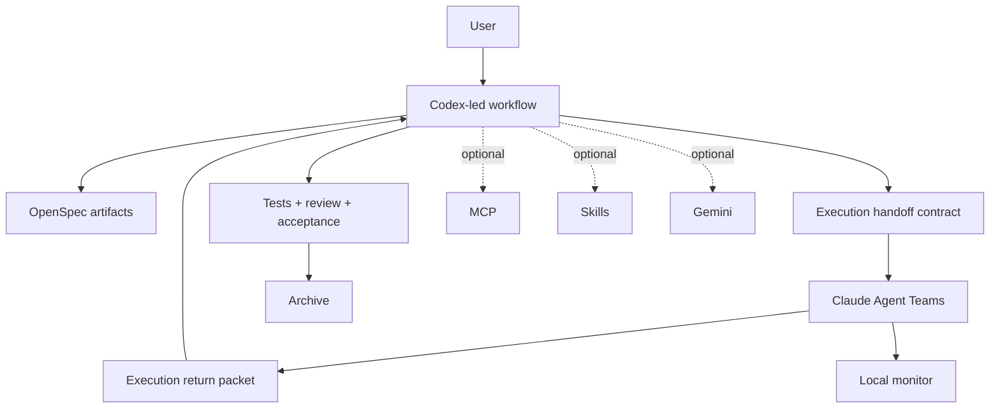

# CCSM

<div align="center">

[](https://www.npmjs.com/package/ccsm)
[](https://opensource.org/licenses/MIT)
[]()

[English](./README.md) | [简体中文](./README.zh-CN.md)

</div>

CCSM is a Codex-led OpenSpec workflow package. Codex owns planning and acceptance, Claude Agent Teams execute bounded implementation, and the local monitor gives you a live view of board status, workflow topology, and runtime activity.

## What CCSM Is For

The maintained path in this fork is:

1. Codex creates or advances an OpenSpec change.
2. Codex prepares the execution handoff contract.
3. Claude Agent Teams implement the scoped work.
4. Codex reviews the result, runs verification, and decides archive readiness.

MCP, extra skills, and Gemini can still be used, but they are optional layers rather than the default workflow.

## Install

### Prerequisites

- Node.js 20+
- Codex for the primary orchestration flow
- Claude Code for execution and local monitor integration

### Run Without Global Install

```bash
npx ccsm
```

### Install Globally

```bash
npm install -g ccsm
ccsm
```

The only maintained command is `ccsm`.

## Quick Start

### 1. Initialize the workflow

```bash
ccsm init
```

During setup, CCSM asks who orchestrates the workflow before model routing is selected. Codex is the recommended default. Base install no longer includes MCP buffet setup. The installer also places Codex-native entry skills under `~/.codex/skills/`.

### 2. Start the monitor

```bash
ccsm monitor
```

To keep it running in the background:

```bash
ccsm monitor --detach
```

By default, the monitor serves at [http://127.0.0.1:4820](http://127.0.0.1:4820).

### 3. Work through the primary OpenSpec flow

```bash
/ccsm:spec-init
/ccsm:spec-research <request>
/ccsm:spec-plan
/ccsm:team-plan
/ccsm:team-exec
/ccsm:team-review
/ccsm:spec-review
openspec archive <change-id>
```

If you want the managed shortcut for Codex dispatch plus Claude execution plus Codex acceptance, use:

```bash
/ccsm:spec-impl
```

Current limitation: Codex skills are prompt-level workflow contracts, not a hard runtime gate. When invoking `spec-impl`, explicitly tell Codex to dispatch through Claude Agent Teams and not to implement locally before `ccsm claude exec` succeeds, for example:

```text
Use spec-impl strictly: prepare the execution packet, dispatch with Claude Agent Teams via ccsm claude exec, and do not edit product code locally unless Claude execution is blocked and I explicitly approve a fallback.
```

### Status-Driven Exec (Recommended Default)

When using `spec-impl`, the recommended execution model is **status-driven exec**:

- **Completion signal**: `sessionStatus` tracks whether a session finished successfully, failed, or was interrupted. This is the authoritative signal for Codex acceptance decisions.
- **Execution Return Packet**: Structured output produced by `ccsm claude exec` and visible in the monitor's workflow view under `outputs`. Contains implementation evidence that Codex validates against the handoff contract.
- **Monitor correlation**: The monitor correlates `sessionStatus` with execution logs so you can verify completion and inspect evidence in one place.
- **Fallback**: If monitor correlation is unavailable (e.g., the monitor is offline or session tracking cannot be established), treat the run as blocked until correlation is restored. Do not silently fall back to assuming success without an authenticated `sessionStatus`.

Example prompt for reliable `spec-impl` behavior:

```text
Run spec-impl with status-driven exec: dispatch via ccsm claude exec, wait for sessionStatus confirmation, then verify the Execution Return Packet in the monitor before accepting implementation results.
```

## CLI Surface

The currently maintained command surface is:

```bash
ccsm
ccsm init
ccsm monitor
ccsm monitor --detach
ccsm monitor restart
ccsm monitor shutdown
ccsm claude
ccsm config mcp
ccsm diagnose-mcp
ccsm fix-mcp
```

What these do:

- `ccsm`: open the interactive menu.
- `ccsm init`: install and configure the workflow.
- `ccsm monitor`: start the local Claude hook monitor.
- `ccsm monitor restart`: restart the local monitor and bind it to the current workspace.
- `ccsm monitor shutdown`: stop the local monitor process when it is owned by CCSM.
- `ccsm claude`: launch Claude through the CCSM dispatcher for Codex handoff scenarios.
- `ccsm config mcp`: configure MCP tokens.
- `ccsm diagnose-mcp`: inspect MCP configuration problems.
- `ccsm fix-mcp`: apply the Windows MCP repair path.

## Monitor

The local monitor is the operational view for the Codex + Claude execution loop. It is designed to make OpenSpec progress and agent activity visible while work is running.

It now supports project selection, selected-project Workflow scoping, startup-only shell filtering, concrete model attribution, Agent Teams live output, and optional ACP/runtime health observations.

Main pages:

- `Board`: current changes, progress, and activity snapshots.
- `Sessions`: searchable session history with status, duration, agent count, and directory context.
- `Workflows`: live DAG view plus session output flow.
- `Analytics`: productivity and workflow telemetry.

### Board



### Sessions



### Workflows



### Analytics



## What Gets Installed

The current install path keeps the workflow host-native while making `.ccsm` the canonical home:

- Claude-facing commands and runtime assets are still installed under `~/.claude/`.
- Codex-native workflow skills are installed under `~/.codex/skills/`.
- Runtime data is stored under `~/.ccsm/`.
- The maintained local monitor runtime lives under `~/.ccsm/claude-monitor`.

## Codex-Native Entry Skills

After installation, CCSM also installs:

- `spec-init`
- `spec-research`
- `spec-plan`
- `spec-impl`
- `spec-review`

These let the primary workflow start directly from Codex while keeping Claude available as the execution layer.

### Current Skill Limitations

- Codex-native skills are guidance loaded into the current Codex session; they do not yet enforce a runtime-level block on local file edits.
- `spec-impl` is designed to dispatch implementation to Claude Agent Teams first, then keep verification and acceptance in Codex.
- If the active session or user prompt says “continue implementation” without restating the dispatch requirement, Codex may still try to implement locally.
- For reliable `spec-impl` behavior, explicitly mention Claude Agent Teams and `ccsm claude exec` when starting the skill.
- If Claude Agent Teams, `ccsm claude exec`, or Claude permissions are unavailable, treat the run as blocked or use the explicit `/ccsm:team-*` commands instead of silently falling back to local Codex implementation.

## Repository Landmarks

```text
src/
|- cli.ts
|- cli-setup.ts
|- commands/
|- utils/
`- i18n/

templates/
|- commands/
|- prompts/
|- codex-skills/
`- skills/

openspec/
`- changes/

claude-monitor/
|- client/
|- server/
`- scripts/
```

## Architecture



## Contributing

- Prefer OpenSpec-first changes over ad hoc edits.
- Do not reintroduce deprecated command or namespace entrypoints.
- Do not describe MCP, extra skills, or Gemini as mandatory for the default product path.
- Keep new docs aligned to the Codex-orchestrated, Claude-executed workflow.

Project workflow guidance lives in [AGENTS.md](./AGENTS.md).

## License

MIT
