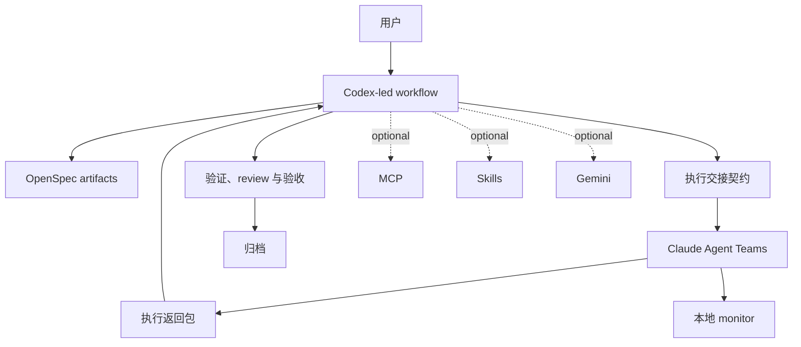

# CCSM

<div align="center">

[](https://www.npmjs.com/package/ccsm)
[](https://opensource.org/licenses/MIT)
[]()

[English](./README.md) | [简体中文](./README.zh-CN.md)

</div>

CCSM 是一个以 Codex 为编排核心、以 OpenSpec 为变更骨架的工作流包。Codex 负责规划、推进和验收，Claude Agent Teams 负责边界清晰的实现执行，本地 monitor 负责把 board、workflow DAG 和运行态活动实时展示出来。

## CCSM 当前的主路径

这个分支当前维护的默认工作流是：

1. Codex 创建或推进 OpenSpec change。
2. Codex 准备执行交接契约。
3. Claude Agent Teams 执行具体实现。
4. Codex 负责 review、验证、验收以及归档决策。

MCP、额外 skills 和 Gemini 仍然可用，但它们已经是可选增强层，不再是默认路径的前置条件。

## 安装

### 前置要求

- Node.js 20+
- Codex，用作主编排入口
- Claude Code，用作执行层与本地 monitor 集成

### 免全局安装运行

```bash
npx ccsm
```

### 全局安装

```bash
npm install -g ccsm
ccsm
```

当前唯一维护中的命令是 `ccsm`。

## 快速开始

### 1. 初始化工作流

```bash
ccsm init
```

初始化时会先询问谁来编排整个工作流，再继续模型路由配置。推荐选择 Codex。基础安装阶段不再包含 MCP 自助选择。安装完成后，CCSM 会把编排入口技能安装到配置的编排端；默认 Codex 编排路径下就是 `~/.codex/skills/`。

### 2. 启动 monitor

```bash
ccsm monitor
```

如果希望后台运行：

```bash
ccsm monitor --detach
```

默认访问地址是 [http://127.0.0.1:4820](http://127.0.0.1:4820)。

### 3. 按主工作流推进 OpenSpec

```bash
/ccsm:spec-init
/ccsm:spec-research <request>
/ccsm:spec-plan
/ccsm:team-plan
/ccsm:team-exec
/ccsm:team-review
/ccsm:spec-review
openspec archive <change-id>
```

如果你希望直接走 Codex 派发、Claude 执行、Codex 验收的一体化捷径，可以使用：

```bash
/ccsm:spec-impl
```

如果你希望用一个 Codex 原生编排入口，自动沿着 `spec-init -> spec-plan -> spec-impl -> spec-review` 持续推进，可以使用：

```bash
/ccsm:spec-fast
```

`spec-fast` 会从第一个缺失或 pending 的阶段继续推进，默认最多自动执行 2 轮 `spec-impl -> spec-review` 返工回路，并在 `archive-ready`、`blocked` 或 `retry-budget-exhausted` 处停止。第一版默认不会自动 archive。

当前限制：Codex skills 仍然是提示层工作流约束，不是运行时强制门禁。使用 `spec-impl` 时，建议明确告诉 Codex 必须先通过 Claude Agent Teams 派发执行，并且在 `ccsm claude exec` 成功前不要本地改产品代码，例如：

```text
严格使用 spec-impl：先整理 execution packet，通过 ccsm claude exec 派发给 Claude Agent Teams 执行；在 Claude 执行未成功启动前，不要由 Codex 本地修改产品代码，除非我明确批准 fallback。
```

### 状态驱动执行（推荐默认模式）

使用 `spec-impl` 时，推荐的执行模型是**状态驱动执行**：

- **完成信号**：`sessionStatus` 追踪 session 是否成功完成、失败或中断。这是 Codex 验收决策的权威信号。
- **执行返回包（Execution Return Packet）**：`ccsm claude exec` 生成的结构化输出，在 monitor 的 workflow 视图中可见，位于 `outputs` 下。包含 Codex 用来对照交接契约进行验证的实现证据。
- **Monitor 关联**：Monitor 将 `sessionStatus` 与执行日志关联，让你可以在同一位置验证完成状态并检查证据。
- **Fallback 行为**：如果 monitor 关联不可用（例如 monitor 离线或无法建立 session 追踪），应将本次执行视为 blocked，直到关联恢复。不要在未获得认证的 `sessionStatus` 情况下静默假设成功。

可靠 `spec-impl` 行为的示例 prompt：

```text
使用状态驱动执行模式运行 spec-impl：通过 ccsm claude exec 派发，等待 sessionStatus 确认，然后在 monitor 中验证 Execution Return Packet 后再接受实现结果。
```

## CLI 命令面

当前维护中的命令主要是：

```bash
ccsm
ccsm init
ccsm monitor
ccsm monitor --detach
ccsm monitor restart
ccsm monitor shutdown
ccsm claude
ccsm config mcp
ccsm diagnose-mcp
ccsm fix-mcp
```

各命令作用如下：

- `ccsm`：打开交互式菜单。
- `ccsm init`：安装并初始化工作流。
- `ccsm monitor`：启动本地 Claude hook monitor。
- `ccsm monitor restart`：重启本地 monitor，并绑定到当前工作区。
- `ccsm monitor shutdown`：在端口进程确认为 CCSM monitor 时关闭本地 monitor。
- `ccsm claude`：通过 CCSM dispatcher 启动 Claude，适用于 Codex 交接执行场景。
- `ccsm config mcp`：配置 MCP token。
- `ccsm diagnose-mcp`：诊断 MCP 配置问题。
- `ccsm fix-mcp`：执行 Windows 环境下的 MCP 修复流程。

## Monitor

本地 monitor 是 Codex 编排 + Claude 执行这条链路的运行态观察面。它的目标不是替代终端，而是把 OpenSpec 进度、session 拓扑和 agent 输出集中可视化。

它现在支持项目选择、按选中项目限定 Workflow、过滤 startup-only shell session、展示更具体的模型归因、实时呈现 Agent Teams 输出，以及可选的 ACP/runtime health 观测。

当 monitor 发现多个 Git worktree 或项目根时，sidebar 会同时显示项目身份与 worktree/root 细节，让相似名称的 worktree 保持可区分。

主要页面包括：

- `Board`：当前 change、进度和活动摘要。
- `Sessions`：可搜索的 session 历史列表，集中展示状态、耗时、agent 数量与目录信息。
- `Workflows`：实时 DAG 视图和 session 输出流。
- `Analytics`：效率与工作流遥测。

### Board


### Sessions


### Workflows


### Analytics


## 安装后会放置哪些内容

当前安装策略是在保持宿主原生发现的前提下，把 `.ccsm` 作为唯一 canonical home：

- 面向宿主的命令与桥接资源安装在配置的编排端 host home 下。
- 编排工作流 skills 安装在配置的编排端技能目录下。默认 Codex 编排路径下是 `~/.codex/skills/`。
- 执行 skills 如果存在，则安装在配置的执行端技能目录下。
- 运行时数据保存在 `~/.ccsm/` 下。
- 当前维护中的本地 monitor 运行时位于 `~/.ccsm/claude-monitor`。

## Codex 原生入口技能

安装后还会提供这些技能：

- `spec-fast`
- `spec-init`
- `spec-research`
- `spec-plan`
- `spec-impl`
- `spec-review`

这样主工作流就可以直接从配置的编排端发起；在推荐的 Codex 编排路径下，Claude 仍是默认执行层。

### 当前技能限制

- Codex 原生 skills 是加载到当前 Codex 会话里的提示约束，暂时不能在运行时硬性阻止本地文件编辑。
- `spec-impl` 的设计目标是先把实现派发给 Claude Agent Teams，再由 Codex 做验证、验收和归档判断。
- `spec-impl` 是编排技能。执行器只能把实现证据返回给编排端；不得运行 `spec-review`，不得编辑当前 change 的 `tasks.md`，不得勾选任务，不得 archive，也不得决定验收是否通过。
- `spec-fast` 也是编排技能。它可以复用 `spec-impl` 与 `spec-review`，但不能绕过 OpenSpec artifacts，不能在派发 blocked 时静默退回 Codex 本地实现，也不能默认自动 archive。
- 如果当前会话或用户提示只说“继续实现”，但没有再次强调 Claude Agent Teams 和派发要求，Codex 仍可能尝试本地直接实现。
- 为了让 `spec-impl` 更稳定地按设计运行，启动时请明确提到 Claude Agent Teams 和 `ccsm claude exec`。
- 如果 Claude Agent Teams、`ccsm claude exec` 或 Claude 权限不可用，应把本次执行视为 blocked，或改用显式的 `/ccsm:team-*` 命令，不要静默 fallback 成 Codex 本地实现。

## 仓库结构

```text
src/
|- cli.ts
|- cli-setup.ts
|- commands/
|- utils/
`- i18n/

templates/
|- commands/
|- prompts/
|- codex-skills/
`- skills/

openspec/
`- changes/

claude-monitor/
|- client/
|- server/
`- scripts/
```

## 架构



## 贡献约束

- 优先采用 OpenSpec 驱动变更，而不是直接无边界修改代码。
- 不要重新引入任何已废弃的旧命令或旧命名空间入口。
- 不要把 MCP、额外 skills 或 Gemini 描述成默认主路径的必需项。
- 新文档和新说明都应围绕“Codex 编排，Claude 执行”这一当前产品叙事。

项目级协作规则见 [AGENTS.md](./AGENTS.md)。

## License

MIT
