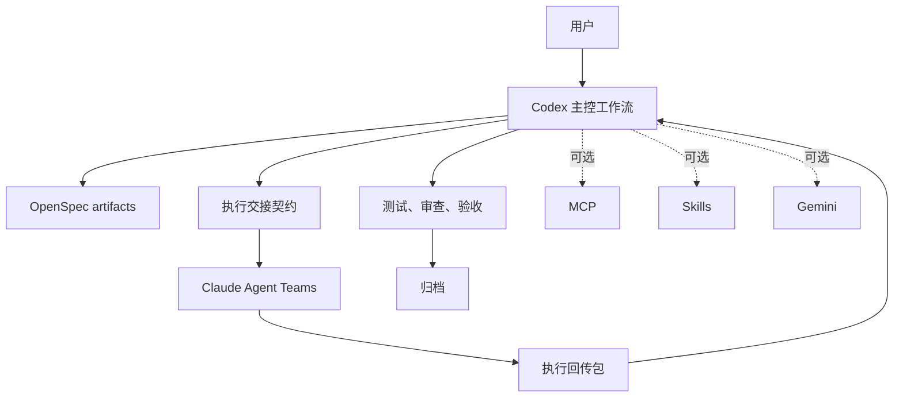

# CCGS

<div align="center">

[](https://www.npmjs.com/package/ccg-workflow)
[](https://opensource.org/licenses/MIT)
[]()

[English](./README.md) | [简体中文](./README.zh-CN.md)

</div>

CCGS 是 `ccg-workflow` 的 Codex 主控分支。这里新增的 `S` 代表 `Spec`：OpenSpec 是主干流程的骨架，Codex 负责 change 推进与验收决策，Claude Agent Teams 负责受边界约束的实现执行。

这个仓库不再沿用上游 README 作为产品叙事。我们仍然会合并上游的兼容性和实现更新，但当前 fork 的默认路径已经明确为：

1. Codex 创建或推进 OpenSpec change。
2. Codex 准备执行交接契约。
3. Claude Agent Teams 按边界实施任务。
4. Codex 回收结果，执行审查、测试、验收与归档判断。

## 为什么有这个 Fork

- Codex 是工作流拥有者，而不是被别的编排器路由的附属模型。
- OpenSpec 是维护路径的必选骨架，而不是可有可无的附属层。
- Claude 仍然很重要，但主要承担执行层职责。
- MCP、skills、Gemini 都保留为可选增强，不再定义默认用户旅程。
- 旧命令和上游兼容入口仍会保留，但它们不再代表主产品路线。

## 主工作流

推荐的完整流程：

```bash
/ccg:spec-init
/ccg:spec-research <需求>
/ccg:spec-plan
/ccg:team-plan
/ccg:team-exec
/ccg:team-review
/ccg:spec-review
openspec archive <change-id>
```

如果你希望让 Codex 统一调度 Claude 执行并保留同一条验收闭环，可以使用 `/ccg:spec-impl` 作为托管捷径。

## Codex 原生入口

安装后，CCGS 还会把以下 Codex 原生技能安装到 `~/.codex/skills/`：

- `ccg-spec-init`
- `ccg-spec-plan`
- `ccg-spec-impl`

这意味着主路径可以直接从 Codex 内启动，而不必再把 Claude 当成唯一宿主入口。

## 兼容流

下面这些入口仍然保留，但定位是兼容流或次级路径，而不是当前主叙事：

- `/ccg:workflow`
- `/ccg:plan`
- `/ccg:execute`
- `/ccg:team-research`
- `/ccg:frontend`
- `/ccg:codex-exec`

同时，`/ccg:backend`、`/ccg:debug`、`/ccg:review`、`/ccg:test`、`/ccg:commit`、`/ccg:worktree` 等工具命令也仍然可用。

## 安装

### 前置依赖

- Node.js 20+
- Codex CLI：主路径推荐宿主
- Claude Code CLI：Agent Teams 执行层与兼容命令入口所需

可选：

- Gemini CLI
- MCP 工具
- 额外复用 skills

### 安装命令

```bash
npx ccg-workflow
```

也可以显式运行：

```bash
npx ccg-workflow init
npx ccg-workflow menu
npx ccg-workflow update
```

安装过程中会先询问由谁负责工作流编排，再继续前后端模型选择。Codex 是推荐默认值，但也保留 Claude 兼容模式。

## 安装结果

当前安装行为兼顾新路径与历史兼容：

- Claude 侧命令和资产安装到 `~/.claude/`
- Codex 原生 workflow skills 安装到 `~/.codex/skills/`
- 工作流配置保存到 `~/.claude/.ccg/`
- `codeagent-wrapper` 仍是后端调用边界

## 仓库结构

```text
src/
├── cli.ts
├── cli-setup.ts
├── commands/
├── utils/
└── i18n/

templates/
├── commands/
├── prompts/
└── skills/

openspec/
└── changes/

codeagent-wrapper/
└── main.go
```

## 架构



## 贡献说明

- 优先走 OpenSpec-first 变更，而不是直接做无上下文的临时修改。
- 删除旧入口前，先明确标注为 compatibility flow。
- 新的产品语言不要再默认 MCP、skills、Gemini 是强制前提。
- 如果修改了 `codeagent-wrapper/` 下的 Go 代码，需要同步更新 `src/utils/installer.ts` 中的 wrapper 版本。

更完整的协作约定见 [AGENTS.md](./AGENTS.md)。

## License

MIT
