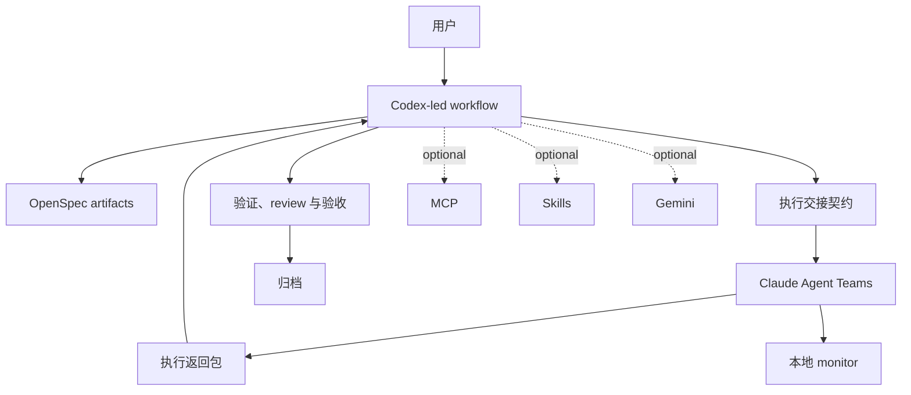

# CCSM

<div align="center">

[](https://www.npmjs.com/package/ccsm)
[](https://opensource.org/licenses/MIT)
[]()

[English](./README.md) | [简体中文](./README.zh-CN.md)

</div>

CCSM 是一个以 Codex 为编排核心、以 OpenSpec 为变更骨架的工作流包。Codex 负责规划、推进和验收，Claude Agent Teams 负责边界清晰的实现执行，本地 monitor 负责把 board、workflow DAG 和运行态活动实时展示出来。

## CCSM 当前的主路径

这个分支当前维护的默认工作流是：

1. Codex 创建或推进 OpenSpec change。
2. Codex 准备执行交接契约。
3. Claude Agent Teams 执行具体实现。
4. Codex 负责 review、验证、验收以及归档决策。

MCP、额外 skills 和 Gemini 仍然可用，但它们已经是可选增强层，不再是默认路径的前置条件。

## 安装

### 前置要求

- Node.js 20+
- Codex，用作主编排入口
- Claude Code，用作执行层与本地 monitor 集成

### 免全局安装运行

```bash
npx ccsm
```

### 全局安装

```bash
npm install -g ccsm
ccsm
```

当前唯一维护中的命令是 `ccsm`。

## 快速开始

### 1. 初始化工作流

```bash
ccsm init
```

初始化时会先询问谁来编排整个工作流，再继续模型路由配置。推荐选择 Codex。基础安装阶段不再包含 MCP 自助选择。安装完成后，CCSM 也会把 Codex 原生入口技能安装到 `~/.codex/skills/`。

### 2. 启动 monitor

```bash
ccsm monitor
```

如果希望后台运行：

```bash
ccsm monitor --detach
```

默认访问地址是 [http://127.0.0.1:4820](http://127.0.0.1:4820)。

### 3. 按主工作流推进 OpenSpec

```bash
/ccsm:spec-init
/ccsm:spec-research <request>
/ccsm:spec-plan
/ccsm:team-plan
/ccsm:team-exec
/ccsm:team-review
/ccsm:spec-review
openspec archive <change-id>
```

如果你希望直接走 Codex 派发、Claude 执行、Codex 验收的一体化捷径，可以使用：

```bash
/ccsm:spec-impl
```

## CLI 命令面

当前维护中的命令主要是：

```bash
ccsm
ccsm init
ccsm monitor
ccsm monitor --detach
ccsm claude
ccsm config mcp
ccsm diagnose-mcp
ccsm fix-mcp
```

各命令作用如下：

- `ccsm`：打开交互式菜单。
- `ccsm init`：安装并初始化工作流。
- `ccsm monitor`：启动本地 Claude hook monitor。
- `ccsm claude`：通过 CCSM dispatcher 启动 Claude，适用于 Codex 交接执行场景。
- `ccsm config mcp`：配置 MCP token。
- `ccsm diagnose-mcp`：诊断 MCP 配置问题。
- `ccsm fix-mcp`：执行 Windows 环境下的 MCP 修复流程。

## Monitor

本地 monitor 是 Codex 编排 + Claude 执行这条链路的运行态观察面。它的目标不是替代终端，而是把 OpenSpec 进度、session 拓扑和 agent 输出集中可视化。

主要页面包括：

- `Board`：当前 change、进度和活动摘要。
- `Sessions`：可搜索的 session 历史列表，集中展示状态、耗时、agent 数量与目录信息。
- `Workflows`：实时 DAG 视图和 session 输出流。
- `Analytics`：效率与工作流遥测。

### Board


### Sessions


### Workflows


### Analytics


## 安装后会放置哪些内容

当前安装策略是在保持宿主原生发现的前提下，把 `.ccsm` 作为唯一 canonical home：

- 面向 Claude 的命令与宿主桥接资源仍安装在 `~/.claude/` 下。
- Codex 原生工作流 skills 安装在 `~/.codex/skills/` 下。
- 运行时数据保存在 `~/.ccsm/` 下。
- 当前维护中的本地 monitor 运行时位于 `~/.ccsm/claude-monitor`。

## Codex 原生入口技能

安装后还会提供这些技能：

- `spec-init`
- `spec-research`
- `spec-plan`
- `spec-impl`
- `spec-review`

这样主工作流就可以直接从 Codex 发起，同时保留 Claude 作为执行层。

## 仓库结构

```text
src/
|- cli.ts
|- cli-setup.ts
|- commands/
|- utils/
`- i18n/

templates/
|- commands/
|- prompts/
|- codex-skills/
`- skills/

openspec/
`- changes/

claude-monitor/
|- client/
|- server/
`- scripts/
```

## 架构



## 贡献约束

- 优先采用 OpenSpec 驱动变更，而不是直接无边界修改代码。
- 不要重新引入任何已废弃的旧命令或旧命名空间入口。
- 不要把 MCP、额外 skills 或 Gemini 描述成默认主路径的必需项。
- 新文档和新说明都应围绕“Codex 编排，Claude 执行”这一当前产品叙事。

项目级协作规则见 [AGENTS.md](./AGENTS.md)。

## License

MIT
