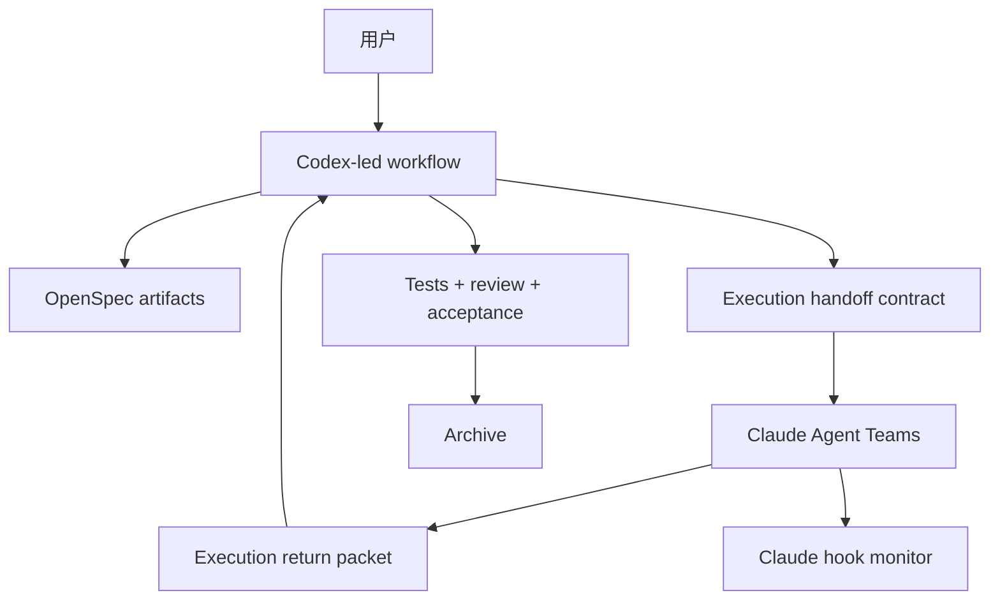

# CCGS

`ccgs-workflow` 是当前原生的 Codex 主控工作流包。

当前主路径已经收敛为：

1. Codex 负责 change 创建、推进和验收。
2. Codex 产出受边界约束的执行交接包。
3. Claude Agent Teams 负责实现执行。
4. Codex 负责 review、测试、acceptance 和 archive。

`MCP` 和额外 skills 仍可作为增强层使用，但它们不再是主路径前提。

## 主工作流

```bash
/ccgs:spec-init
/ccgs:spec-research <需求>
/ccgs:spec-plan
/ccgs:team-plan
/ccgs:team-exec
/ccgs:team-review
/ccgs:spec-review
openspec archive <change-id>
```

如果你希望从 Codex 里直接把 Claude 执行和最终验收串起来，可以使用：

```bash
/ccgs:spec-impl
```

## Codex 原生入口

安装后会把以下 skills 放到 `~/.codex/skills/`：

- `ccgs-spec-init`
- `ccgs-spec-plan`
- `ccgs-spec-impl`

这意味着主路径可以直接从 Codex 启动，不需要把 Claude 作为宿主入口。

## 安装

前置依赖：

- Node.js 20+
- Codex CLI
- Claude Code CLI

安装命令：

```bash
npx ccgs-workflow
```

也可以显式执行：

```bash
npx ccgs-workflow init
npx ccgs-workflow menu
npx ccgs-workflow update
npx ccgs-workflow monitor install
npx ccgs-workflow monitor hooks
npx ccgs-workflow monitor start --detach
```

## 安装结果

当前默认会安装这些资产：

- Claude 侧命令、prompts、rules、skills 到 `~/.claude/`
- Codex 原生 workflow skills 到 `~/.codex/skills/`
- Claude monitor 到 `~/.claude/.ccgs/claude-monitor`
- Claude hooks 写入 `~/.claude/settings.json`

当前维护的本地监控面板是 Claude hook monitor。

## 仓库结构

```text
src/
├── cli.ts
├── cli-setup.ts
├── commands/
├── utils/
└── i18n/

templates/
├── commands/
├── prompts/
├── codex-skills/
└── skills/

openspec/
└── changes/

claude-monitor/
├── client/
├── server/
└── scripts/
```

## 架构



## 维护说明

- 优先使用 OpenSpec 驱动变更，而不是直接做无边界修改。
- 删除旧入口前，先把产品叙事、命令集和安装行为切到新路径。
- 新增文档不要把旧兼容命令或多模型并行当成默认前提。

更完整的协作规则见 [AGENTS.md](./AGENTS.md)。

## License

MIT
